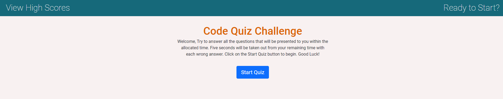
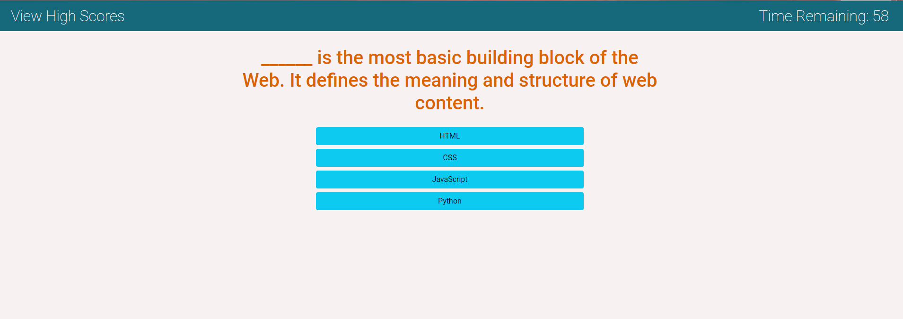
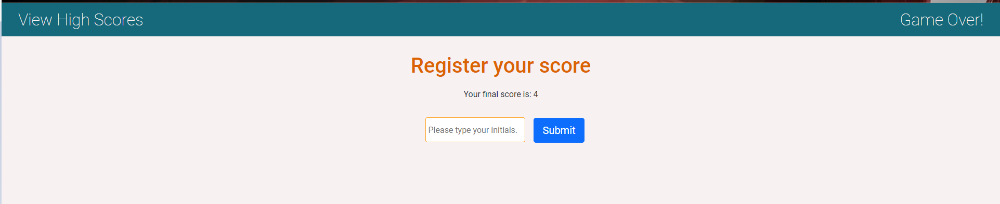
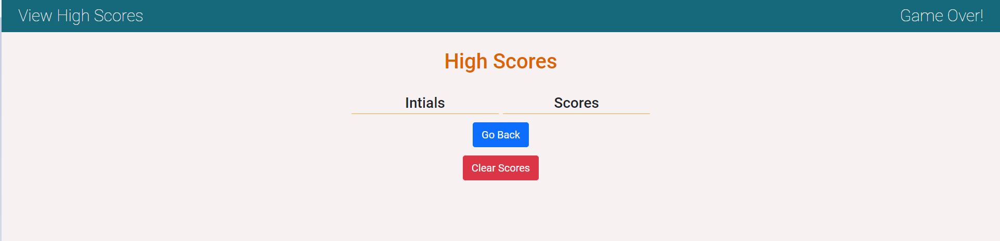
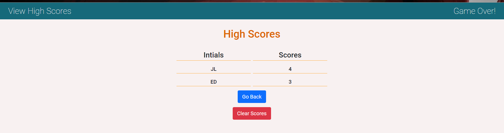
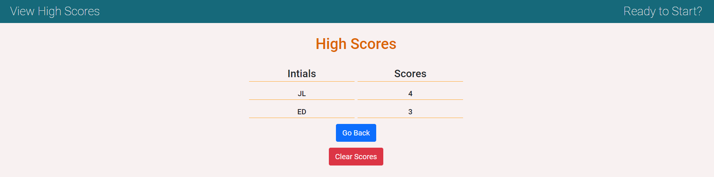

# code-quiz
1. Summary: This application will render a fixed group of questions and their possible answers, keep track of the correct results and add 1 point for each correct answer, as well as challenge the user to answer before the time limit. If all questions are answered or the time runs out, the page will render the results and ask the user to provide their initials to store the results, which can be retrieved by clicking on View High Scores. Note during the quiz View High Cores is disabled to prevent the user from getting out of the quiz.

2. Pictures:

- Home Page:

- Questions and Timer Running:

- Register Results:

- Empty Scores:

- Scores after completing the quiz:

- Scores When Clicking on View High Scores:

